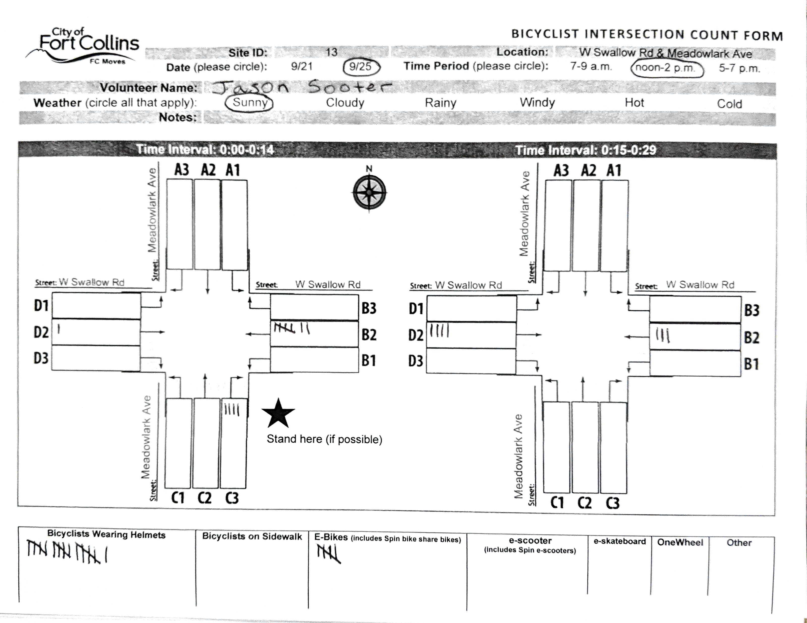
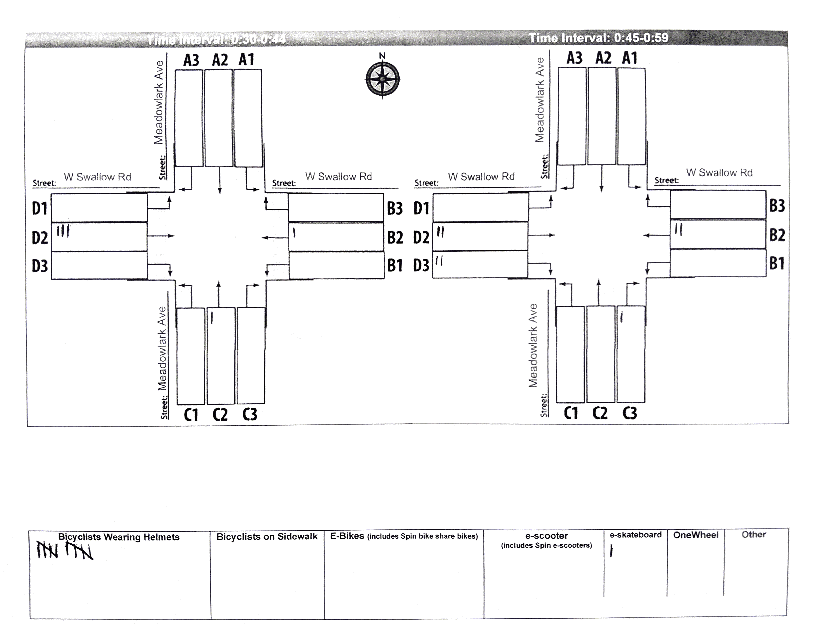
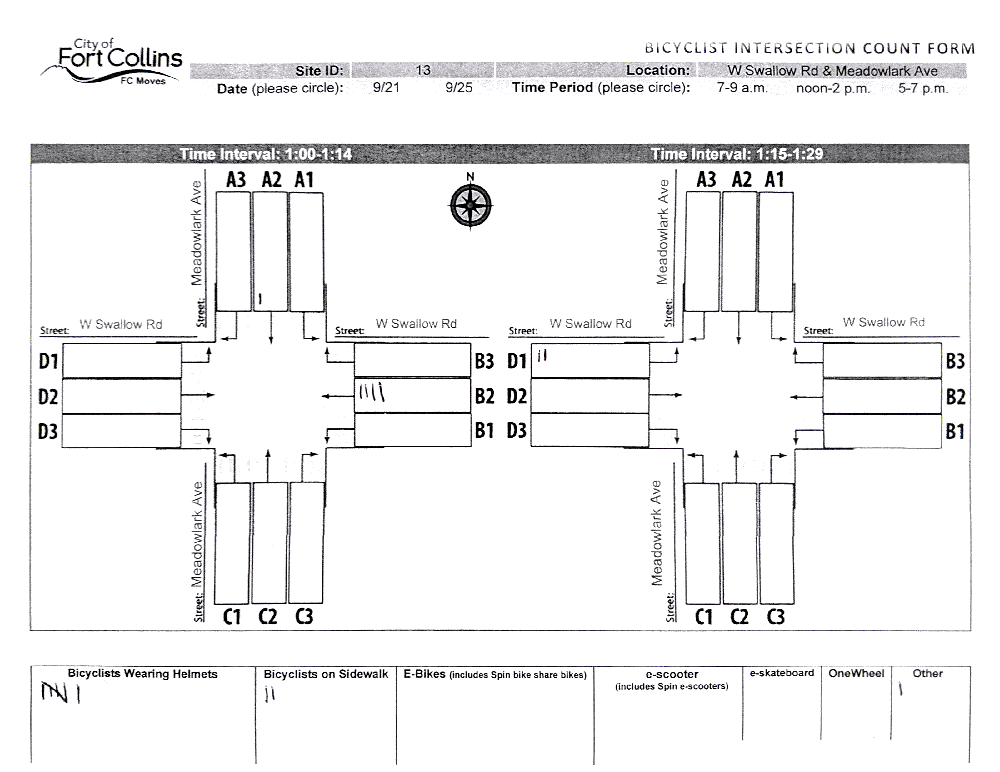
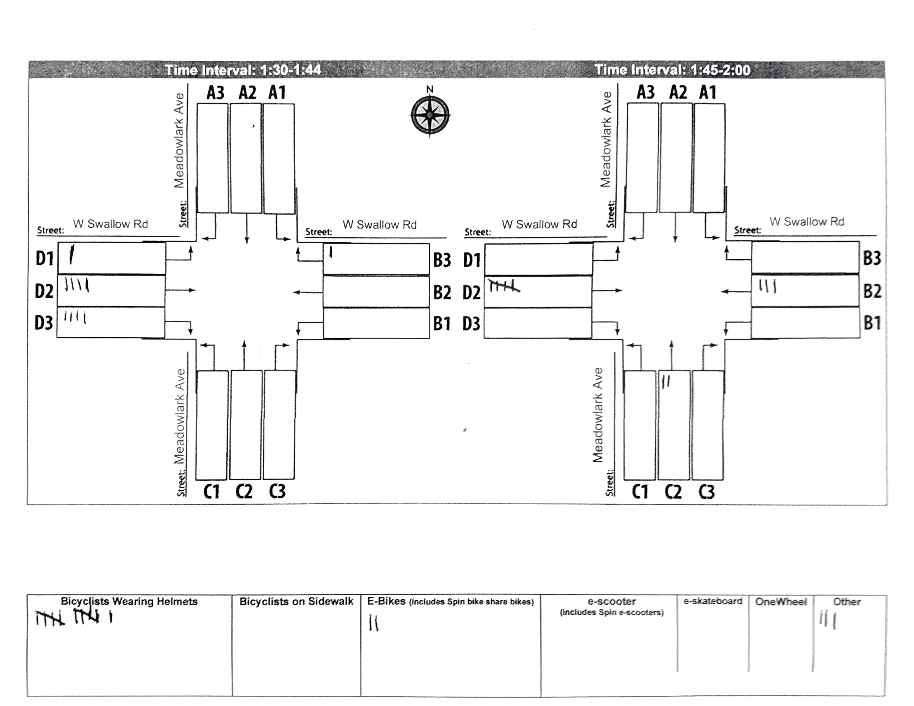

Each year, the Fort Collins FC Moves organization performs a survey that
generates data about the count of various non-car traffic at intersections
across the city. This includes:

- Bikes
- Skateboards
- Scooters
- One Wheels

To improve precision about the counts, extra criteria was provided to break up
counts by 2 categories:

1. Were they e-powered? i.e. e-Bikes & e-Scooters
2. Was a helmet worn?

In 2021, I participated by counting at an intersection near me that my kids & I
often go t of W Swallow Rd & Meadowlark Ave

- Site ID 13
- Location: W Swallow Rd & Meadowlark Ave

It is a fun project to participate in and the kids enjoyed it. Improving bike
safety in a community is about many 1% improvements

