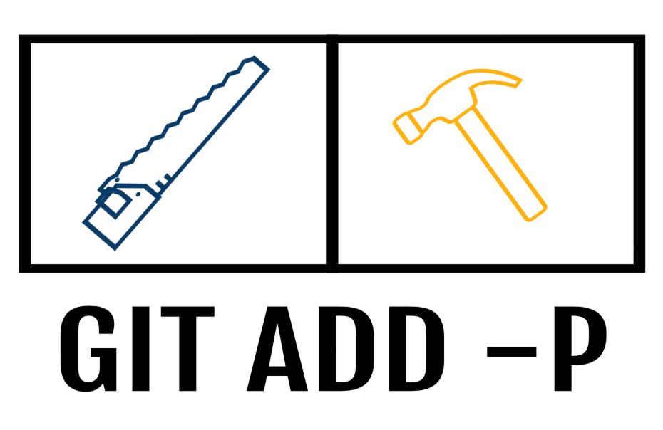

My experience was occasional (but never heavy) use of [gitKraken](https://www.gitkraken.com/) to commit a certain section of code. However, most of my daily git work happens while using the [VSCode Diff UI](https://code.visualstudio.com/docs/editor/versioncontrol) or via the CLI.


I use the CLI for many tasks such as:

* creating branches (`git checkout -b`)
* switching branches (`git checkout <branch name>`)
* viewing branches (`git branch`)
* removing branches (`git branch -D <branch name>`)
* interactive rebase (`git rebase -i`)
* checkout a branch using the hub tool (`hub pr checkout <pr number>`)

(I put all the most common ones here just in case anyone wants to point me to the error in my ways ;-) )

So I'm not unfamiliar with the CLI but have not found it useful for file diffing. I guess I'd put myself in the category of being a very visual differ. In the past, and not necessarily with git, I have even found a tool called [BeyondCompare](https://www.scootersoftware.com/index.php) to be so incredibly useful at diffing files, text, etc that I can't really go back to just red/green in my terminal.

Fast-forward to today when I came across a [tweet](https://mobile.twitter.com/kyleshevlin/status/1152339936722317312) from [@kyleshevlin](https://mobile.twitter.com/kyleshevlin)

<blockquote class="twitter-tweet"><p lang="en" dir="ltr">\\\\`git add -p\\\\` has become one of my favorite git commands. I recommend getting to know how it works, really helps you make better, atomic commits, even after doing bunch of work. 👍</p>&mdash; Kyle Shevlin (@kyleshevlin) <a href="https://twitter.com/kyleshevlin/status/1152339936722317312?ref_src=twsrc%5Etfw">July 19, 2019</a></blockquote> <script async src="https://platform.twitter.com/widgets.js" charset="utf-8"></script>

With the intriguing hook of "becoming one of my favorite git commands", I was drawn in to explore. The deliverable of "better, atomic commits" meets the criteria for all good git hygiene improvement.

At first glance, I didn't know what `-p` was or the verbose command behind it (`--patch`). The first article I came across while searching (and there are many) was:

* [A Quick Guide to Hunky Git by Jacob Herrington on Dev.to](https://dev.to/jacobherrington/a-quick-guide-to-hunky-git-49no)

I'd recommend his article as it was well written and a great place to start.

Here is a general description of `-p`/`--patch`:

```
-p, --patch
Interactively choose hunks of patch between the index and the work tree and add them 
to the index. This gives the user a chance to review the difference before adding 
modified contents to the index.
```

As the article and others will explain, adding `-p` to the `git add` command will walk you through an interactive selection of chunks of code (instead of a committing a whole file), allowing for adding just those chunks to your next commit.

Simple enough, and I plan to integrate this much more often into my daily work. However, as this falls into the Diffing files category of my git usage, and I diff files with git inside of VSCode, I immediately started searching how to use this workflow inside the Diff UI of VSCode.

After a bit of [searching](https://stackoverflow.com/a/46069010/1149728), I determined this functionality is built in as the following commands:

* `git.stageSelectedRanges` AND
* `git.unstageSelectedRanges`

You can find them in the command menu along with the context-menu when right-clicking inside of a file. Great! Almost there...

Now I just needed a keyboard shortcut. This [Stackoverflow post](https://stackoverflow.com/a/46069010/1149728) covered adding them as a  keybinding including the right `when` context as well.

Adding this to your keyboard shortcuts/bindings will allow for pressing `s` and `u` while highlighting a specific line/selection that has changed and staging it for your next commit.

```
{
  "key": "s",
  "command": "git.stageSelectedRanges",
  "when": "isInDiffEditor && editorTextFocus"
},
{
  "key": "u",
  "command": "git.unstageSelectedRanges",
  "when": "isInDiffEditor && editorTextFocus"
}
```

I'm excited to use this new improvement for "better, more atomic commits".

Thanks [Kyle](https://mobile.twitter.com/kyleshevlin), [Jacob](https://dev.to/jacobherrington) and [Markus](https://stackoverflow.com/users/6279949/markus-klug) for the inspiration to kick off that process!


